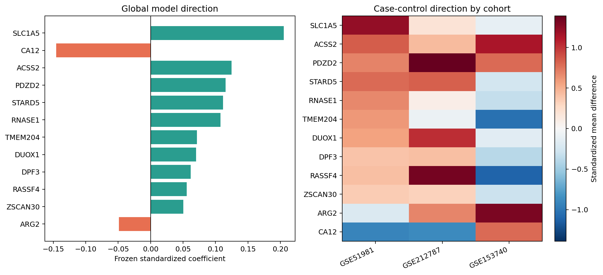

# EndoSignature-Net

**A leakage-aware, multi-cohort transcriptomics study of endometriosis**

> Project status: **research complete; portfolio-ready**.

EndoSignature-Net integrates single-cell RNA sequencing, bulk RNA sequencing,
and microarray cohorts to discover, validate, model, and interpret a compact
endometriosis-associated gene signature. The project emphasizes patient-level
inference, explicit cohort eligibility gates, independent external application,
and transparent reporting of both successful and failed replication.

The final model is an interpretable 12-gene L2-logistic classifier. More complex
architectures, including neural networks and nonlinear baselines, were
benchmarked but not selected merely for complexity. Internal repeated
patient-level validation reached mean ROC-AUC 0.860. A locked external RNA-seq
application was promising but inconclusive in GSE212787 (ROC-AUC 0.738; 95% CI
0.429-0.976), while GSE153740 did not replicate the signature (ROC-AUC 0.125;
95% CI 0.000-0.500). This heterogeneity is a central result, not a hidden
failure.

Read the illustrated [final research report](docs/FINAL_RESEARCH_REPORT.md) or
the [portfolio summary](docs/PORTFOLIO_SUMMARY.md).



## Technical Approach

- **Patient-level design:** splits, bootstraps, and sensitivity analyses operate
  at patient/sample level rather than treating cells as independent patients.
- **Multi-modal evidence:** scRNA-seq discovery and localization are integrated
  with bulk RNA-seq and microarray replication.
- **Locked external analysis:** external labels are not used for feature,
  architecture, sign, hyperparameter, or threshold tuning.
- **Interpretability:** standardized coefficients, repeated held-out permutation
  importance, bootstrap sign stability, and per-patient gene contributions.
- **Claim discipline:** association is separated from causality, localization
  from disease direction, and clean-control discrimination from clinical
  specificity.

## Tech Stack
- **Languages:** Python
- **Frameworks:** PyTorch, Scanpy, Pandas, Scikit-learn
- **Methods:** sparse scRNA-seq QC, patient-level pseudobulk, nested and repeated
  cross-validation, logistic regression, SVMs, neural-network benchmarking,
  bootstrap uncertainty, permutation importance, and cross-platform replication

## Data Sources
This project integrates multiple public datasets from NCBI GEO:
- **Single-Cell Atlases:**
  - [GSE213216](https://www.ncbi.nlm.nih.gov/geo/query/acc.cgi?acc=GSE213216) - Comprehensive endometriosis atlas.
  - [GSE179640](https://www.ncbi.nlm.nih.gov/geo/query/acc.cgi?acc=GSE179640) - Integrated lesion and endometrial atlas.
- **Bulk Transcriptomics:**
  - [GSE51981](https://www.ncbi.nlm.nih.gov/geo/query/acc.cgi?acc=GSE51981) - Endometrial tissue classification.
  - [GSE135485](https://www.ncbi.nlm.nih.gov/geo/query/acc.cgi?acc=GSE135485) - Pathological vs. normal tissue RNA-seq.
- **Independent replication and technical-audit cohorts:**
  - [GSE212787](https://www.ncbi.nlm.nih.gov/geo/query/acc.cgi?acc=GSE212787)
  - [GSE153740](https://www.ncbi.nlm.nih.gov/geo/query/acc.cgi?acc=GSE153740)
  - [GSE120103](https://www.ncbi.nlm.nih.gov/geo/query/acc.cgi?acc=GSE120103)
  - [GSE25628](https://www.ncbi.nlm.nih.gov/geo/query/acc.cgi?acc=GSE25628)

## Completed workflow
1. Data Acquisition & Preprocessing (QC, Normalization)
2. Patient-aware Single-Cell Atlas and Cell-Type Annotation
3. Pseudobulk Signature Discovery and Multi-Study Evidence Integration
4. Architecture Benchmarking and Internal Patient-Level Validation
5. Locked External Replication and Sensitivity Analysis
6. Model Interpretability, Literature Audit, and Claim-Boundary Assessment

## Data Pipeline
The pipeline performs outcome-blind sample intake, sparse single-cell QC,
doublet auditing, patient-level pseudobulk aggregation, within-study
normalization, explicit candidate mapping, and cohort eligibility checks.
Thresholds, exclusions, and limitations are persisted as machine-readable
reports rather than applied silently.

## Model Architecture
The final frozen model is L2 logistic regression over 12 genes. Logistic,
elastic-net, linear and RBF SVM, random-forest, gradient-boosting, MLP, and
gene-attention architectures were evaluated under the same patient-level
benchmark. Complexity was not treated as evidence of superiority.

## Training Pipeline
Model assessment uses repeated and nested patient-level cross-validation,
class-balanced training, out-of-fold predictions, bootstrap uncertainty, and
locked external application. Interpretation uses standardized linear
coefficients, coefficient bootstrap stability, held-out permutation importance,
and per-patient logit contributions.

## Reproducible Sample Metadata

Before quality control or model training, generate the local data manifest:

```bash
python build_metadata.py
```

The command scans `data/` without extracting the large archives and writes four
documented reports under `output/reports/`:

- `file_inventory.csv`: one row for every physical file, including its size,
  format, technology and inferred GEO study.
- `sample_metadata.csv`: one row per logical sample. The three files belonging
  to a 10x Matrix Market sample are represented as one sample.
- `sample_summary.csv`: sample counts grouped by study, technology, condition
  and tissue.
- `archive_inventory.csv`: the members of each `.tar` archive, recorded without
  extracting the archive.

The fields `patient_id`, `condition` and `tissue` are inferred conservatively
from the naming scheme used by the downloaded GEO files. The columns
`metadata_source`, `review_status` and `notes` preserve this provenance. Records
marked `needs_review` must not be used for training until they have been checked
against authoritative GEO sample metadata. In particular, the analysis does not
classify a sample as endometriosis merely because its filename contains the
letter `E`.

`parsed_from_filename` means that all fields required for the initial EDA were
parsed successfully; it does not mean that the biological annotation has been
independently verified.

## Single-cell QC and EDA

Generate the metadata reports first, then run the initial per-sample QC for the
discovery cohort:

```bash
python build_metadata.py
python run_sc_eda.py --study-id GSE179640
```

The EDA processes samples sequentially and keeps the count matrices sparse. It
does not overwrite the downloaded matrices, normalize expression, select highly
variable genes, correct batch effects or train a model. These later operations
must only be designed after the QC results have been reviewed.

### Initial thresholds

The default secondary-QC thresholds are intentionally explicit:

- at least 200 detected genes per cell;
- at most 20% mitochondrial counts per cell;
- each retained gene must occur in at least 3 retained cells;
- no upper gene-count threshold is applied during the initial pass.

The exact settings used for every run are saved to `qc_thresholds.json`. They
can be changed from the command line, for example:

```bash
python run_sc_eda.py --max-pct-mito 15 --max-genes 7500
```

The H5 inputs are Cell Ranger filtered matrices, so this is a documented
secondary QC pass rather than QC of raw droplets. A sample is flagged for manual
review when fewer than 200 cells remain or when less than 50% of its cells are
retained. Flags are diagnostics, not automatic sample-exclusion decisions.

### EDA outputs

For `GSE179640`, the command writes:

- `output/eda_plots/per_sample/GSE179640/`: one pre-filter QC dashboard per
  sample;
- `output/eda_plots/cohort/GSE179640/`: cohort-level sample-size, retention and
  tissue comparison plots;
- `output/reports/qc/GSE179640/qc_sample_summary.csv`: before/after counts and
  sample-level QC medians;
- `output/reports/qc/GSE179640/qc_flagged_samples.csv`: samples requiring review;
- `output/reports/qc/GSE179640/qc_processing_errors.csv`: failures preserved for
  audit rather than silently discarded;
- `output/reports/qc/GSE179640/qc_thresholds.json`: the exact filtering policy.

The initial EDA includes all eligible tissue codes, including organoids, to make
the inventory complete. This does not imply that organoids or different lesion
sites should be pooled in the primary disease classifier.

Two Matrix Market objects (`GSM6102564` and `GSM6102566`) contain only HHTO
cell-hashing features rather than gene-expression features. The metadata builder
detects these feature vocabularies, labels the objects as `cell_hashing`, and
excludes them from expression QC. They may be useful later for demultiplexing,
but they are not standalone transcriptomic samples.

## Primary cohort and doublet detection

After reviewing the initial QC, define the primary discovery comparison and run
per-sample Scrublet:

```bash
python run_cohort_definition.py
```

The primary cohort is restricted to the 12 GEO-verified endometrial samples in
GSE179640: 3 control endometrium samples and 9 eutopic endometrium samples from
patients with endometriosis. Ectopic lesions, adjacent tissues and organoids are
retained for secondary analyses instead of being pooled into the primary
condition comparison.

Scrublet is run independently for each sample after the previously documented
cell and gene QC. The default expected doublet rate is 6%, the random seed is
fixed at 0, and samples with more than 15% predicted doublets are flagged for
manual review rather than automatically excluded. Both the algorithm settings
and cell-level predictions are persisted for reproducibility.

The command writes the following files under `output/reports/cohort/`:

- `verified_sample_metadata.csv`: local metadata augmented with GEO-verified
  condition, location, tissue, method and provenance URLs;
- `doublet_summary.csv`: per-sample scores, thresholds and predicted rates;
- `cell_doublets/*.csv.gz`: sample-qualified cell IDs and cell-level predictions;
- `sample_inclusion_decisions.csv`: an explicit role, decision and reason for
  every logical data record;
- `primary_cohort_samples.csv`: samples approved for the primary comparison;
- `doublet_settings.json`: exact reproducibility settings;
- `doublet_processing_errors.csv`: failures retained for audit.

Score histograms are written to `output/eda_plots/doublets/GSE179640/`. A
Scrublet prediction is a computational QC flag, not proof that a barcode is a
doublet. Final filtering should be evaluated alongside cell-type annotations
and sample-level score distributions.

## Uncorrected primary atlas

Build the first combined atlas after QC and doublet detection:

```bash
python run_primary_atlas.py
```

The command loads only samples approved in `primary_cohort_samples.csv`, joins
cell-level Scrublet predictions by sample-qualified barcode, removes predicted
doublets from the derived atlas, and intersects the gene space across all 12
samples. It then stores raw counts in `layers['counts']`, normalizes every cell
to 10,000 counts, applies `log1p`, and selects 2,000 highly variable genes with
`sample_id` as the batch key. PCA, a 15-neighbor graph and UMAP are computed
without batch correction.

This uncorrected embedding is diagnostic. It must be inspected before choosing
Harmony, scVI or another integration method, because correction can remove real
biology as well as technical structure. Descriptive silhouette and neighbor
mixing metrics are reported for sample, patient and condition, but they cannot
by themselves distinguish batch effects from cell-type composition.

Outputs include:

- `output/artifacts/GSE179640_primary_atlas_full.h5ad`: normalized full-gene
  atlas with raw counts retained in a layer;
- `output/artifacts/GSE179640_primary_atlas_hvg.h5ad`: compact 2,000-HVG atlas;
- `output/reports/atlas/`: settings, filtering, sample composition and
  uncorrected batch diagnostics;
- `output/eda_plots/atlas/GSE179640_primary/`: PCA, UMAP and cohort composition
  plots.

No batch correction, clustering, cell-type annotation, differential expression
or model training is performed at this stage.

## Discovery-only clustering and provisional cell types

Cluster and provisionally annotate the uncorrected GSE179640 atlas:

```bash
python run_cell_type_annotation.py
```

Leiden clustering is computed at resolutions 0.5, 0.8 and 1.0 with resolution
0.8 used for the primary exploratory report. Broad cell-family annotations are
assigned from curated epithelial, stromal, endothelial, mural, lymphoid,
myeloid, dendritic and mast-cell marker panels. Cluster markers are ranked with
the Wilcoxon method across the full normalized gene space.

All labels produced by this stage are explicitly `provisional`, and every output
is marked `GSE179640_discovery_only`. A marker-panel assignment is a starting
point for expert review, not a final annotation. Composition is reported as a
fraction within each patient/sample before condition-level summaries are made;
raw cell counts are not treated as independent biological replicates.

This project contains four studies with separate roles:

- `GSE179640`: current discovery atlas;
- `GSE213216`: independent single-cell validation and label-transfer target;
- `GSE135485`: bulk RNA-seq signature validation;
- `GSE51981`: microarray signature validation.

The current clusters, markers and cell-family proportions must not be generalized
beyond GSE179640 until the independent studies have been processed. Outputs are
written to `output/reports/cell_types/GSE179640_discovery/`,
`output/eda_plots/cell_types/GSE179640_discovery/`, and the derived annotated
atlas `output/artifacts/GSE179640_discovery_annotated_provisional.h5ad`.

## Independent GSE213216 validation cohort

Prepare the second single-cell study from the local GEO archive and run its QC:

```bash
python prepare_gse213216.py
python run_sc_eda.py \
  --study-id GSE213216 \
  --metadata output/reports/validation/GSE213216/sample_metadata.csv
```

`prepare_gse213216.py` parses the official NCBI GEO MINiML metadata and streams
only the filtered Cell Ranger gene-expression matrix from each nested sample
archive. It supports both filtered H5 and filtered Matrix Market layouts. Raw
matrices, molecule-information files and spatial images are not extracted.
This reduces the processed on-disk data to approximately 795 MB and leaves the
16 GB source archive unchanged.

The official metadata contains 51 GEO records. The local archive provides 45
filtered scRNA-seq matrices suitable for this stage: 43 H5 matrices and 2 Matrix
Market matrices. They represent 19 patients and five tissue classes:

- 22 endometriosis-lesion samples;
- 9 eutopic-endometrium samples;
- 6 endometrioma samples;
- 4 unaffected-ovary samples;
- 4 samples from sites where no endometriosis was detected.

Three Visium spatial-transcriptomics records and three records without a local
filtered single-cell matrix are documented in the manifest but excluded from
scRNA-seq QC. The exclusion is based on data modality or matrix availability,
not on biological outcome.

The phrase `No endometriosis detected` describes the sampled tissue site. It
does not establish that the patient is an endometriosis-free healthy control.
Accordingly, every GSE213216 record retains `control_status=not_established`,
and the four site-negative samples are labeled
`no_endometriosis_detected_site`, not `Control`. GSE213216 is therefore used
first for independent cell-family and marker validation; it is not treated as a
drop-in replication of the GSE179640 healthy-control versus eutopic-endometrium
comparison.

Using the same documented secondary-QC thresholds as GSE179640, all 45 matrices
were processed without errors. Of 412,750 cells in the Cell Ranger filtered
inputs, 364,321 cells (88.27%) passed the minimum-gene and mitochondrial filters.
One sample, `GSM6574550`, was flagged for review because only 31.41% of its cells
were retained; it has not been silently removed. The other 44 samples passed the
initial sample-level review rules.

Validation outputs are kept separate from discovery outputs:

- `output/source_metadata/GSE213216/`: archived official MINiML metadata;
- `output/reports/validation/GSE213216/sample_metadata.csv`: authoritative
  sample manifest, archive mapping and inclusion status;
- `output/reports/qc/GSE213216/`: QC summary, thresholds, flags and processing
  errors;
- `output/eda_plots/per_sample/GSE213216/`: 45 pre-filter QC dashboards;
- `output/eda_plots/cohort/GSE213216/`: cohort-level QC figures.

The next analysis stage should run doublet detection independently per
GSE213216 sample, review `GSM6574550`, and then validate the broad GSE179640
cell-family labels by reference mapping. Patient identifiers must be retained
for every split and statistical comparison; cells from one patient must never
be divided across training and evaluation sets.

## GSE213216 per-sample doublet detection

Run Scrublet independently after validation QC:

```bash
python run_validation_doublets.py
```

The command reapplies the saved GSE213216 cell-QC thresholds before running
Scrublet. The expected doublet rate is 6%, the random seed is 0, and a sample is
formally flagged when its predicted doublet rate exceeds 15%. These values are
saved in `doublet_settings.json`. The expected rate is a modeling prior rather
than a requirement that 6% of every sample be labeled as doublets.

All 45 samples completed without processing errors. Scrublet evaluated the
364,321 cells that passed secondary QC and predicted 6,776 doublets. All saved
cell scores and sample thresholds were finite. No sample crossed the predefined
15% formal-review boundary, although three samples had elevated rates that
should be inspected during mapping: `GSM6574533` (13.78%), `GSM6574537`
(10.84%) and `GSM6574542` (10.72%). These observations were not used to change
the review threshold after seeing the results.

`GSM6574550`, previously flagged for low cell retention, had only one predicted
doublet among 955 QC-retained cells (0.10%). This shows that its low complexity
is not explained by a high Scrublet doublet rate, so it remains a sample-level
review case rather than being reinstated automatically. The combined decision
table contains 44 mapping candidates and one scRNA-seq review sample.

Outputs are written to:

- `output/reports/validation/GSE213216/doublets/doublet_summary.csv`;
- `output/reports/validation/GSE213216/doublets/cell_predictions/`;
- `output/reports/validation/GSE213216/doublets/sample_decisions.csv`;
- `output/reports/validation/GSE213216/doublets/mapping_candidates.csv`;
- `output/reports/validation/GSE213216/doublets/samples_requiring_review.csv`;
- `output/eda_plots/doublets/GSE213216/`.

Predicted doublets are removed only when constructing a derived validation
object; the downloaded inputs are never modified. The next step is reference
mapping or label transfer from the GSE179640 discovery atlas. Mapping confidence
must be evaluated per sample and per broad cell family before using the
transferred labels for cross-study marker validation.

## Experimental GSE213216 reference mapping

Run patient-aware reference mapping:

```bash
python run_validation_mapping.py
```

The provisional GSE179640 labels are learned from its existing 30-dimensional
PCA representation with a class-balanced logistic classifier. Class balancing
is used here because the reference family sizes range from 91 dendritic cells
to 14,421 epithelial cells. It is not used to correct tissue or disease-class
imbalance. The reference classifier is evaluated with five-fold `GroupKFold`
using `patient_id` as the grouping unit before being fitted to all discovery
cells.

Mean patient-grouped reference performance was 0.896 macro-F1 and 0.948 balanced
accuracy. Recovery was weakest for smooth-muscle/pericyte (76.5% recall) and
stromal/fibroblast (79.2% recall), indicating a known boundary between these
related mesenchymal families. These metrics measure recovery of the provisional
GSE179640 labels in held-out GSE179640 patients; they do not prove that the
labels are biologically correct in GSE213216.

Each validation sample is QC-filtered again, joined exactly to its Scrublet
predictions and stripped of predicted doublets. Because per-sample gene QC
removes low-prevalence genes, projection uses the available intersection with
the reference genes and records the number of shared genes and HVGs. The
normalized sparse matrix, raw-count layer, reference-PCA coordinates,
transferred family and mapping score are saved as a separate H5AD per sample to
avoid constructing one memory-intensive dense object.

The primary mapping included 44 samples and 356,591 singlets with no processing
errors. Across samples, a median of 1,891 of the 2,000 reference HVGs was
available. Using an exploratory score threshold of 0.60, the median sample had
89.7% high-score cells. The classifier probabilities are **not calibrated**;
`mapping_confidence` is a relative model score, not a biological probability.

The external results contain an important domain-shift warning. Unaffected-ovary
samples had the weakest sample-level scores, and 24,530 ovarian cells were
assigned to the mast-cell family, an implausibly large result that requires
marker-based review. This is consistent with the fact that the discovery
reference contains control and eutopic endometrium, not a comprehensive ovary
reference. Therefore, transferred labels are experimental and must not yet be
used as validated cell identities. Eutopic-endometrium mapping is more directly
comparable, while lesion, endometrioma and ovary mappings require stronger
out-of-domain checks.

Outputs include:

- `output/reports/validation/GSE213216/mapping/reference_patient_grouped_cv.csv`;
- `output/reports/validation/GSE213216/mapping/mapping_sample_summary.csv`;
- `output/reports/validation/GSE213216/mapping/mapping_family_summary.csv`;
- `output/reports/validation/GSE213216/mapping/transferred_cell_labels.csv.gz`;
- `output/reports/validation/GSE213216/mapping/mapping_processing_errors.csv`;
- `output/artifacts/GSE213216_mapped_samples/`: 44 sparse mapped H5AD objects.

The next required step is independent marker-panel validation of every
transferred family, with special attention to ovary, mast cells, epithelial
cells and the stromal/pericyte boundary. Low-support or marker-inconsistent
labels should be changed to `Uncertain` rather than forced into one of the 12
discovery families.

## External marker-concordance validation

Check transferred labels against core marker expression:

```bash
python run_marker_validation.py
```

For each mapped cell, marker genes are standardized within its sample and
averaged into 12 core panel scores. The transferred label is compared with the
highest-scoring marker panel and with raw-count marker detection. The
predeclared conservative rule requires:

- mapping score of at least 0.60;
- the transferred family to be the highest-scoring marker panel;
- at least two predicted-family markers, and at least 25% of the available
  panel, detected in the raw-count layer.

Cells satisfying all criteria are `marker_supported`. Cells satisfying only two
of the three main signals are `partial_support`; all others are `uncertain`.
Only `marker_supported` cells retain a family in `conservative_cell_family`.
Other cells receive `Uncertain`; their original transferred label remains
available for auditing.

All 44 mapped samples and 356,591 singlets completed without errors. Only
162,510 transferred labels (45.57%) met the complete marker-support rule;
98,335 (27.58%) had partial support and 95,746 (26.85%) were uncertain. This
confirms that classifier scores alone substantially overstated external
reliability.

Support was strongest for B cells (93.0%), myeloid cells (77.8%), cycling cells
(77.2%), NK cells (71.7%), endothelial cells (63.4%) and T cells (62.3%).
Support was weak for smooth-muscle/pericyte (28.7%), macrophage (25.4%),
epithelial (22.3%), dendritic (17.2%) and mast-cell labels (2.2%). These results
do not prove that the supported labels are ground truth; related marker
knowledge was used to create the provisional discovery annotations.

The ovary warning was confirmed decisively. Of 24,530 ovarian cells transferred
as mast cells, only 2 met the complete marker-support rule. A total of 23,668
expressed none of the five core mast-cell markers. The conservative result
therefore retains only 2 of these cells as mast cells and changes the rest to
`Uncertain`. Overall marker support in ovary was 13.4%, compared with 48.8% in
eutopic endometrium, supporting the conclusion that the endometrial discovery
reference is unsuitable as a comprehensive ovarian reference.

Outputs include:

- `output/reports/validation/GSE213216/marker_validation/cell_marker_validation.csv.gz`;
- `output/reports/validation/GSE213216/marker_validation/family_marker_support.csv`;
- `output/reports/validation/GSE213216/marker_validation/tissue_family_marker_support.csv`;
- `output/reports/validation/GSE213216/marker_validation/sample_marker_support.csv`;
- `output/eda_plots/marker_validation/GSE213216/`;
- `output/artifacts/GSE213216_marker_validated_samples/`: 44 sparse H5AD
  objects containing original, transferred and conservative labels.

The next step is to restrict cross-study biological validation to
marker-supported cells and biologically comparable tissues. Eutopic
endometrium should be analyzed first. Ovary should remain out of the primary
cross-study label-transfer analysis unless a suitable ovarian reference or
independent annotation workflow is added.

## GSE179640 patient-level pseudobulk signatures

Discover exploratory cell-family signatures without treating cells as
independent replicates:

```bash
python run_discovery_pseudobulk.py
```

Raw counts are summed for each patient/sample within each provisional cell
family. A patient-family aggregate is retained only when at least 10 cells
contribute to it. A family is tested only when at least 3 control patients and
6 endometriosis patients remain. This makes the patient, rather than the cell,
the biological replicate and prevents cell-level pseudoreplication.

The comparison is control endometrium versus eutopic endometrium from patients
with endometriosis. Counts are converted to CPM within each pseudobulk and
log2-transformed with a 0.5 pseudocount. Genes require at least 1 CPM in at
least 3 pseudobulks. Welch tests compare patient-level log2-CPM values, and
Benjamini-Hochberg correction is performed separately within each cell family.
An effect-size candidate requires an absolute mean log2-CPM difference of at
least 1.

Because only three control patients are available, every gene also undergoes a
leave-one-control-out direction check and a leave-one-endometriosis-patient-out
check. The strongest tier requires FDR below 0.10, absolute effect of at least
1, and an unchanged effect direction in every leave-one-out calculation.
Despite these checks, this remains exploratory small-cohort analysis rather
than confirmatory differential expression.

The pipeline created 122 patient-family pseudobulks. Seven families met the
predeclared replication rule: endothelial, epithelial, macrophage, myeloid,
NK, stromal/fibroblast and T cells. B cells, cycling cells, dendritic cells,
mast cells and smooth-muscle/pericyte cells were not tested because too few
control patients had at least 10 contributing cells.

Across the seven eligible families, 102,137 gene-family rows were tested. A
total of 265 rows met the FDR, effect-size and leave-one-out direction-stability
criteria: 143 in NK cells, 59 in epithelial cells, 37 in macrophages, 22 in T
cells and 4 in endothelial cells. No row met all three criteria in myeloid or
stromal/fibroblast cells. Candidate examples include `CCNF` in NK cells,
`PRKACB`, `ARHGEF6`, `WNT11` and `MME` in epithelial cells, `BIVM` and
`ANKRD26` in macrophages, and `RAB3B` in T cells.

These candidates must be interpreted cautiously. For example, proliferative
genes such as `MKI67` appear in the NK-family results and `PDGFRA` also appears
there, suggesting residual cell-state or annotation mixture. The analysis
therefore provides a candidate-ranking layer, not a final biomarker list.

`PTGS1` was present but did not pass FDR in any eligible family. Its largest
effects were approximately -1.00 in endothelial and -1.07 in epithelial
pseudobulks, both with high FDR. `MMP10` did not pass the predeclared expression
filter in the eligible families. Neither gene is supported as a robust
cell-family disease marker by this discovery pseudobulk analysis alone.

Outputs include:

- `output/reports/signatures/GSE179640_pseudobulk/pseudobulk_sample_metadata.csv`;
- `output/reports/signatures/GSE179640_pseudobulk/cell_family_eligibility.csv`;
- `output/reports/signatures/GSE179640_pseudobulk/cell_family_differential_expression.csv.gz`;
- `output/reports/signatures/GSE179640_pseudobulk/exploratory_signature_candidates.csv`;
- `output/reports/signatures/GSE179640_pseudobulk/pseudobulk_settings.json`;
- `output/eda_plots/signatures/GSE179640_pseudobulk/`.

GSE213216 cannot validate the same disease effect because it does not provide a
confirmed healthy-control endometrium group comparable to GSE179640. It can
later test whether candidate genes are expressed in the expected supported
cell families, but disease-direction validation must use an independent
case-control cohort. The next dataset-level step is therefore to process the
bulk case-control studies, beginning with GSE135485.

## GSE135485 verified bulk RNA-seq EDA

Run the metadata-verified bulk QC and exploratory analysis:

```bash
python run_gse135485_eda.py
```

The local `GSE135485_Endometriosis_raw_counts.csv.gz` file contains 37,233
unique gene symbols and 58 sample columns. All expression values are
non-negative integers, confirming that the file is a raw gene-count matrix
rather than normalized expression. Every column is matched exactly to an NCBI
GEO GSM record using the archived family SOFT metadata; filename prefixes are
not used as biological labels.

The verified local cohort contains 54 records labeled `patient with
endometriosis` and only 4 healthy-endometrium controls. One healthy control has
an `E62` title rather than an `EN` prefix, demonstrating why prefix-based
classification would have been incorrect. GEO describes the 54 disease
records collectively as `endometrial samples and lesions` and does not separate
eutopic endometrium from lesion tissue at the sample-record level.

Per-sample QC reports raw library size, detected genes, zero fraction,
mitochondrial fraction, ribosomal fraction and robust median/MAD scores. Genes
are retained for EDA when they reach at least 1 CPM in at least 4 samples,
leaving 21,575 genes. PCA is calculated from centered log2(CPM + 0.5), and
Spearman sample correlations are reported independently of condition labels.

Thirteen samples trigger at least one robust review flag. These flags are not
automatic exclusions: several high-detected-gene samples are controls or lane
L001 samples, so the flag may represent systematic library complexity rather
than poor quality. `GSM4012536` (`E47_S10_L004_R1_001`) is the strongest
technical concern: it has only 7,393 detected genes, a 4.13-million-read
library and median Spearman correlation 0.467 to the remaining cohort. Two
additional disease samples, `GSM4012514` and `GSM4012509`, have unusually small
libraries but substantially higher gene complexity and correlation, so they
remain sensitivity-analysis candidates rather than primary exclusions.

PC1 explains 16.5% and PC2 explains 7.8% of filtered log2-CPM variance. Healthy
controls do not form a clean isolated cluster, and the disease samples are
highly heterogeneous. The cohort is also partially confounded by sequencing
lane: 3 of 4 controls are from lane L001, whereas only 2 of 54 disease samples
are from that lane. Lane must therefore be considered in any downstream model.

The suitability decision is explicit:

- the available metadata does **not** support a clean external replication of
  the GSE179640 control-endometrium versus eutopic-endometrium comparison;
- a secondary broad pathological-versus-healthy analysis is possible with
  strict sensitivity checks, lane adjustment where estimable and transparent
  tissue-confounding caveats;
- `GSM4012536` should be excluded in the primary sensitivity model and restored
  in a robustness run;
- validation should emphasize candidate effect direction and leave-one-control
  stability, not nominal significance alone.

Outputs include:

- `output/source_metadata/GSE135485/GSE135485_family.soft`;
- `output/reports/bulk/GSE135485/verified_sample_metadata.csv`;
- `output/reports/bulk/GSE135485/sample_qc_summary.csv`;
- `output/reports/bulk/GSE135485/samples_requiring_review.csv`;
- `output/reports/bulk/GSE135485/filtered_log2_cpm.csv.gz`;
- `output/reports/bulk/GSE135485/pca_coordinates.csv`;
- `output/reports/bulk/GSE135485/sample_correlation_summary.csv`;
- `output/reports/bulk/GSE135485/analysis_suitability.json`;
- `output/eda_plots/bulk/GSE135485/`.

## GSE135485 tissue-level signature validation

Run the predeclared external candidate analysis:

```bash
python run_gse135485_signature_validation.py
```

The validation set is fixed from the GSE179640 patient-level discovery results
before fitting any GSE135485 association. Specifically, it includes only
`fdr_effect_direction_stable` rows. The 265 eligible gene-family rows represent
259 unique genes. Six genes occur in more than one cell family, and all repeated
discoveries have a consistent disease direction. The pipeline would exclude
and report any direction-conflicting gene rather than choosing a direction
post hoc.

Thirty-four candidates are absent from the expression matrix retained by the
predeclared GSE135485 filter, leaving 225 genes for primary validation. For
each available gene, the model is:

```text
log2(CPM + 0.5) ~ endometriosis status + categorical sequencing lane
```

Ordinary least squares is used with HC3 heteroscedasticity-robust standard
errors. The primary model contains 57 samples: 4 controls and 53 disease
records after excluding the strong `GSM4012536` (`E47`) technical outlier.
The categorical lane design has full rank (8/8 columns) and condition number
17.4. This confirms numerical estimability, but does not remove the biological
limitation created by partial condition-lane confounding.

A candidate is called `directionally_replicated` only if all three rules hold:

1. the lane-adjusted primary coefficient matches the GSE179640 direction;
2. the direction remains matched when `E47` is restored;
3. the direction remains matched in all four leave-one-control-out models.

`Statistically_supported` additionally requires Benjamini-Hochberg FDR below
0.10 across the 225 available, externally predeclared genes. No bulk effect-size
threshold is imposed because a cell-family-specific signal may be diluted in
whole tissue.

Seventy-nine of 225 genes meet the strict directional-replication rule. Nine
also pass candidate-set FDR below 0.10: `GNB4`, `CARD6`, `PDZD2`, `PDGFRA`,
`FGD6`, `CYSLTR1`, `BST1`, `TMEM268`, and `NLRC5`. These nine include three
NK-cell discoveries, three epithelial discoveries, two macrophage discoveries,
and one T-cell discovery. They are the strongest current cross-platform
candidates, but they remain tissue-level support rather than confirmed
cell-family biomarkers.

The overall discovery-versus-bulk effect correlation is weak, which is expected
to some degree because GSE135485 mixes endometrial samples and lesions and bulk
expression conflates cell abundance with within-cell transcription. Therefore,
the 79 directionally robust genes are retained as a broader replication tier,
while the nine FDR-supported genes form the highest-priority tier for later
single-cell validation.

`PTGS1` and `MMP10` are tracked separately and are not inserted into the
predeclared candidate set. `PTGS1` is available and has a positive
lane-adjusted bulk coefficient (1.94 log2-CPM units; nominal p=0.0011), but it
did not satisfy the original GSE179640 stable-discovery rule and therefore
cannot be claimed as externally validated by this analysis. `MMP10` is
available in bulk but was not tested after the discovery expression filter; its
bulk coefficient is negative and not nominally significant (p=0.30).

Outputs include:

- `output/reports/validation/GSE135485_signature_validation/gene_level_validation_results.csv`;
- `output/reports/validation/GSE135485_signature_validation/gene_family_validation_results.csv.gz`;
- `output/reports/validation/GSE135485_signature_validation/unavailable_candidate_genes.csv`;
- `output/reports/validation/GSE135485_signature_validation/conflicting_discovery_directions.csv`;
- `output/reports/validation/GSE135485_signature_validation/predefined_gene_tracking.csv`;
- `output/reports/validation/GSE135485_signature_validation/validation_summary.json`;
- `output/eda_plots/validation/GSE135485_signature_validation/`.

The next research step is to return to GSE213216 and construct a
marker-supported, tissue-restricted cell-family validation cohort. The nine
highest-priority genes and the broader 79-gene directional tier can then be
tested for expression in the expected cell families without treating the
current provisional label transfer as ground truth.

## GSE213216 marker-supported candidate localization

Run the tissue-restricted cellular analysis:

```bash
python run_gse213216_cellular_validation.py
```

This stage asks whether the 79 genes with robust bulk directional replication
are preferentially expressed in the GSE179640 discovery cell family. It does
**not** test endometriosis disease direction: GSE213216 has no confirmed
healthy-control endometrium group comparable to the GSE179640 discovery
contrast.

The primary cohort is fixed conservatively:

- only cells with `marker_validation_status == marker_supported` are used;
- only `EuE` and `EndoLesion` tissues are included;
- ovary and endometrioma are excluded because of the previously observed
  marker-label discordance;
- expression is calculated from raw counts as per-cell
  `log1p(count / total counts * 10,000)`;
- cells are aggregated by patient, tissue and conservative cell family before
  statistical testing.

For every candidate gene-family pair, expected-family expression is compared
with all other marker-supported families from the same patient and tissue.
The comparison requires at least 20 expected-family cells, 100 comparator
cells and 5 paired patients. A one-sided paired Wilcoxon test asks whether
expected-family expression is higher. FDR correction is applied jointly across
all eligible gene-family-tissue tests.

A test is called directionally consistent when median expected-family
expression is higher, the gene is detected in at least 1% of expected-family
cells and at least 70% of paired patients have a positive difference. Formal
`cell_family_localized` support additionally requires FDR below 0.10.

The 79 genes produce 158 tissue-specific tests, of which 155 have sufficient
patient replication. Sixteen tests, representing ten genes, satisfy the
descriptive directional-consistency rule. However, none passes the predeclared
FDR threshold: the minimum adjusted value is 0.1009. This is reported as no
formal cellular localization rather than rounding the threshold or changing it
after observing the data.

Feature sets are not identical across all 44 H5AD artifacts. Every candidate is
available in at least 10 artifacts, while 35 of 79 are available in all 44.
Availability is reported explicitly per gene, and the paired-patient
eligibility rule prevents sparse feature coverage from being interpreted as
negative localization evidence.

The closest signals are `OSBPL3` in NK cells, `ANKRD36C` and `ZNF470` in
endothelial cells in EuE (each FDR 0.1009). `OSBPL3` is directionally
consistent in both EuE and lesions. `RNASE1` shows the largest expected-family
expression difference in macrophages and is consistent in both tissues, but
has only six eligible paired patients per tissue and does not survive
multiplicity correction.

Among the nine high-priority bulk-supported genes, only `PDZD2` shows
directionally consistent epithelial localization in both tissues. Its lesion
result has nominal p=0.0098 but FDR=0.252. The other eight do not preferentially
localize to their provisional discovery families under this test. Several
examples, including `PDGFRA` assigned to NK cells, are biologically discordant
and reinforce that provisional discovery-family labels must not be treated as
validated ground truth.

The null formal result is scientifically informative. It indicates that the
current nine-gene cross-platform tier is stronger as a disease-associated
tissue signature than as a validated cell-family-specific signature.
`PDZD2` is retained as the leading high-priority cellular candidate, while
`OSBPL3`, `ANKRD36C`, `ZNF470`, `RNASE1`, `AMOT`, `FAM102B`, `IL6ST`, `MYRIP`
and `TRPM3` remain descriptive localization candidates requiring an additional
independent cohort or refined annotation.

Outputs include:

- `output/reports/validation/GSE213216/candidate_localization/predeclared_candidate_gene_families.csv`;
- `output/reports/validation/GSE213216/candidate_localization/patient_tissue_family_expression.csv.gz`;
- `output/reports/validation/GSE213216/candidate_localization/paired_patient_localization_metrics.csv.gz`;
- `output/reports/validation/GSE213216/candidate_localization/cell_family_localization_results.csv`;
- `output/reports/validation/GSE213216/candidate_localization/gene_localization_summary.csv`;
- `output/reports/validation/GSE213216/candidate_localization/candidate_gene_availability.csv`;
- `output/reports/validation/GSE213216/candidate_localization/cellular_validation_summary.json`;
- `output/eda_plots/validation/GSE213216/candidate_localization/`.

The next dataset-level step is verified preprocessing and EDA of GSE51981. That
microarray cohort can provide another independent tissue-level test of the
GSE179640/GSE135485 candidates. Model development should remain downstream of
that additional validation rather than optimize directly on the current
candidate list.

## GSE51981 verified microarray EDA

The initial local inventory contained only
`GSM1256712_127.CEL.gz`. A single CEL file cannot support between-array
normalization, PCA, outlier comparison or disease association. The official
GSE51981 series matrix and the official GPL570 probe annotation are therefore
used for the primary reproducible EDA:

```bash
python run_gse51981_eda.py
```

The NCBI GEO record contains 148 unique endometrial samples measured on the
Affymetrix Human Genome U133 Plus 2.0 Array (`GPL570`). The official matrix has
54,675 probe sets and 148 samples. GEO states that all arrays were normalized
simultaneously using GCRMA with probe affinities and the `fullmodel` option.
Consequently, the pipeline does not apply RNA-seq normalization or a second
quantile-normalization step to the processed matrix.

Official sample characteristics define three clinically distinct groups:

- 77 endometriosis samples;
- 34 non-endometriosis samples with no uterine/pelvic pathology;
- 37 non-endometriosis samples with other uterine/pelvic pathology.

The 37 other-pathology samples are not relabeled as healthy controls. The
predeclared primary validation contrast is endometriosis versus the 34
no-pathology controls; the other-pathology samples are reserved for a secondary
specificity analysis.

Menstrual-cycle phase is available for almost every sample. The primary groups
are not perfectly phase balanced:

| Clinical group | Proliferative | Early secretory | Mid-secretory | Late secretory | Unknown |
|---|---:|---:|---:|---:|---:|
| Endometriosis | 29 | 18 | 28 | 0 | 2 |
| No-pathology control | 20 | 6 | 8 | 0 | 0 |
| Other pathology | 15 | 6 | 14 | 2 | 0 |

Cycle phase is therefore a required covariate rather than a descriptive label.
It accounts descriptively for 75.2% of PC2 between-group variation, while
clinical group accounts for 29.8% of PC1 variation. PC1 explains 40.7% of
overall variance and PC2 explains 16.2%.

Two endometriosis records (`GSM1256696` and `GSM1256702`) have inconsistent
official severity fields: their source labels say severity is unavailable,
while a separate characteristic reports moderate/severe or minimal/mild.
Their endometriosis status is concordant and retained, but severity analyses
must flag these records.

Probe sets are mapped using the official GPL570 annotation dated August 2016.
Only probes with one unambiguous gene symbol are retained. Multiple probes for
the same gene are collapsed by their sample-wise median, producing 20,845
mapped genes. The median rule avoids choosing the most disease-associated or
most variable probe after observing the validation data.

Processed-data QC reports sample expression median, IQR, mean, standard
deviation and Spearman correlation with the cohort. This is not a replacement
for raw CEL diagnostics such as NUSE or RLE. Reproducing those diagnostics
would require the full 711.8 MB RAW archive rather than the one CEL file
originally stored locally.

Three endometriosis arrays are flagged for unusually narrow processed
expression distributions:

- `GSM1256655` (sample 103, proliferative);
- `GSM1256659` (sample 134, mid-secretory);
- `GSM1256665` (sample 136, mid-secretory).

Their median cohort correlations remain high (0.911–0.926), and the minimum
median correlation across all 148 samples is 0.874. The flags are therefore
review indicators, not automatic exclusions. The primary validation model
should retain all three and repeat the candidate analysis with them excluded.

The resulting suitability decision is:

- GSE51981 supports an independent tissue-level candidate validation;
- the primary model should use gene expression as the outcome and include
  endometriosis status plus menstrual-cycle phase;
- the 34 no-pathology samples are the clean control group;
- the 37 other-pathology samples provide a secondary test of disease
  specificity;
- processed-distribution flags and the two severity inconsistencies require
  sensitivity reporting;
- the dataset cannot validate a cell-family origin because it is bulk
  endometrial microarray data.

Outputs include:

- `output/source_metadata/GSE51981/GSE51981_series_matrix.txt.gz`;
- `output/source_metadata/GSE51981/GPL570.annot.gz`;
- `output/reports/microarray/GSE51981/verified_sample_metadata.csv`;
- `output/reports/microarray/GSE51981/processed_sample_qc.csv`;
- `output/reports/microarray/GSE51981/samples_requiring_review.csv`;
- `output/reports/microarray/GSE51981/gcrma_gene_expression.csv.gz`;
- `output/reports/microarray/GSE51981/probe_to_gene_mapping.csv.gz`;
- `output/reports/microarray/GSE51981/pca_coordinates.csv`;
- `output/reports/microarray/GSE51981/pca_explained_variance.csv`;
- `output/reports/microarray/GSE51981/pca_factor_associations.csv`;
- `output/reports/microarray/GSE51981/analysis_suitability.json`;
- `output/eda_plots/microarray/GSE51981/`.

The next step is predeclared candidate validation in GSE51981. It should first
test the nine GSE135485 FDR-supported genes, then the broader 79-gene
directional tier, adjust for cycle phase, retain all processed-QC review
samples in the primary model, and use the other-pathology group to distinguish
endometriosis association from a nonspecific pelvic-pathology signal.

## GSE51981 cycle-adjusted signature validation

Run the final pre-model external validation:

```bash
python run_gse51981_signature_validation.py
```

The candidate set is fixed before testing GSE51981. It contains the 79 genes
that showed robust directional replication from GSE179640 into GSE135485.
Nine of these form the previous FDR-supported high-priority tier. Seventy-five
candidates are present in the GPL570 gene-level matrix; `FLRT2`, `LINC02009`,
`NBPF9` and `TMEM131L` are unavailable after unambiguous probe mapping.

The primary per-gene model is:

```text
GCRMA gene expression ~ endometriosis + categorical menstrual-cycle phase
```

It compares 77 endometriosis samples with 34 no-pathology controls and uses
HC3 heteroscedasticity-robust standard errors. The same model is repeated after
excluding the three processed-distribution QC review samples and after
excluding the two disease samples with unknown cycle phase. Every one of the
111 primary samples is also removed in turn. Robust directional replication
requires the discovery direction in the primary model, both sensitivity
models and all 111 leave-one-sample-out fits.

A second cycle-adjusted model compares the 77 endometriosis samples with 37
non-endometriosis samples that have another uterine/pelvic pathology. This is a
specificity contrast: it tests whether a candidate distinguishes endometriosis
from other pathology rather than merely distinguishing any pathological cohort
from healthy controls.

Of the 75 available genes:

- 21 retain the discovery direction in every primary sensitivity analysis;
- 12 of those pass candidate-set FDR below 0.10 versus clean controls;
- none passes FDR below 0.10 in the same direction versus other pathology.

The 12 clean-control-supported genes are `SLC1A5`, `CA12`, `STARD5`, `ACSS2`,
`ARG2`, `RNASE1`, `TMEM204`, `RASSF4`, `PDZD2`, `DPF3`, `ZSCAN30` and `DUOX1`.
Only `TMEM204`, `RASSF4` and `DPF3` retain the discovery direction in the
other-pathology contrast, and their specificity FDR values are 0.172, 0.880
and 0.905 respectively. They therefore remain specificity candidates rather
than supported endometriosis-specific genes.

Among the previous nine-gene high-priority tier, only `PDZD2` passes the
GSE51981 primary validation. Its cycle-adjusted difference is +0.675 with
FDR=0.021, and its direction is unchanged in all QC, phase-complete and
leave-one-sample-out analyses. `PDZD2` does not distinguish endometriosis from
the other-pathology group: its specificity effect is -0.108 with FDR=0.852.
Together with its descriptive epithelial localization in GSE213216, this makes
`PDZD2` the strongest current cross-dataset pathological-endometrium candidate,
but not an endometriosis-specific diagnostic biomarker.

Three previous high-priority genes show statistically strong effects in the
opposite direction to discovery: `CARD6`, `TMEM268` and `FGD6`. The remaining
high-priority genes are weak or directionally inconsistent. These results
prevent the nine-gene GSE135485 tier from being promoted unchanged into a final
signature.

The Spearman correlation between GSE135485 bulk effects and GSE51981
cycle-adjusted effects is only 0.074 across the 75 available genes. This weak
global concordance is consistent with the major cohort differences:
GSE135485 combines lesions and endometrial samples, whereas GSE51981 measures
endometrium and explicitly spans menstrual-cycle phases.

`PTGS1` and `MMP10` remain outside the candidate multiplicity family. Both are
available, but neither is supported versus clean controls (`PTGS1` p=0.507;
`MMP10` p=0.249), and both have negative adjusted effects. They are not carried
forward as validated signature genes.

Outputs include:

- `output/reports/validation/GSE51981_signature_validation/gene_level_validation_results.csv`;
- `output/reports/validation/GSE51981_signature_validation/unavailable_candidate_genes.csv`;
- `output/reports/validation/GSE51981_signature_validation/predefined_gene_tracking.csv`;
- `output/reports/validation/GSE51981_signature_validation/validation_summary.json`;
- `output/eda_plots/validation/GSE51981_signature_validation/`.

The next step is evidence integration rather than immediate model training. A
gene-level evidence table should combine discovery stability, GSE135485 bulk
support, GSE213216 cellular localization and GSE51981 cycle-adjusted
validation. The modeling signature must be frozen from that table before any
patient-level model is trained or evaluated.

## Cross-dataset evidence integration and frozen signatures

Run the versioned evidence-integration stage:

```bash
python run_evidence_integration.py
```

Version `v1.0` integrates all 259 unique genes from the stable GSE179640
discovery tier. Every output row preserves the discovery direction, discovery
families and effect, GSE135485 availability/effect/FDR/robustness, GSE213216
localization evidence, and GSE51981 primary and specificity evidence. Missing
or untested evidence is not converted into a negative biological result.

The signature rules are fixed and non-weighted:

- **Core multistudy pathology candidate:** GSE135485 FDR support, GSE51981
  clean-control FDR support, and directional cellular localization in
  GSE213216.
- **Extended clean-control signature:** robust GSE135485 directional
  replication and GSE51981 clean-control FDR support.
- **Specificity watchlist:** membership in the extended signature plus the
  discovery direction in the other-pathology contrast, without formal
  specificity FDR.
- **Endometriosis-specific support:** extended-signature evidence plus
  same-direction FDR below 0.10 against other pathology.

The frozen `v1.0` core contains only `PDZD2`. It is a multistudy
pathological-endometrium candidate, not a formally endometriosis-specific
biomarker.

The frozen extended clean-control signature contains 12 genes:

```text
PDZD2, DPF3, TMEM204, RASSF4, CA12, ACSS2,
RNASE1, ARG2, SLC1A5, STARD5, ZSCAN30, DUOX1
```

These genes have a stable discovery-to-GSE135485 direction and pass the
cycle-adjusted GSE51981 comparison with no-pathology controls. The signature's
valid target is therefore **pathological/endometriosis endometrium versus clean
controls**. It must not be described as specific for endometriosis.

The specificity watchlist contains `DPF3`, `TMEM204` and `RASSF4`. All three
retain the discovery direction against other pathology, but none passes
specificity FDR. No gene meets the formal endometriosis-specific rule.

The previous nine-gene GSE135485 tier is reassessed explicitly. `PDZD2` is the
only retained core gene. The remaining eight are marked as not replicated in
GSE51981 under the full robustness rule rather than silently disappearing from
the report.

The modeling-readiness decision is deliberately conservative:

- an exploratory pathology-versus-clean-control benchmark is possible with the
  frozen 12-gene signature;
- an endometriosis-specific signature is not ready;
- a deep-learning model is not yet justified by the number of independent
  patients and the absence of an untouched test cohort;
- GSE51981 cannot be presented as an untouched test set because its labels
  contributed to freezing the 12-gene signature;
- all preprocessing and any hyperparameter selection must be nested within
  patient-level cross-validation;
- the next model should be a regularized logistic-regression benchmark, not a
  neural network.

Outputs include:

- `output/reports/evidence_integration/v1.0/integrated_gene_evidence.csv`;
- `output/reports/evidence_integration/v1.0/frozen_core_pathology_signature.csv`;
- `output/reports/evidence_integration/v1.0/frozen_extended_clean_control_signature.csv`;
- `output/reports/evidence_integration/v1.0/specificity_watchlist.csv`;
- `output/reports/evidence_integration/v1.0/prior_high_priority_reassessment.csv`;
- `output/reports/evidence_integration/v1.0/modeling_readiness.json`;
- `output/reports/evidence_integration/v1.0/evidence_integration_settings.json`;
- `output/eda_plots/evidence_integration/v1.0/`.

The next implementation stage is a leakage-controlled baseline feasibility
study. It should use the frozen `v1.0` extended signature, compare against a
one-gene `PDZD2` baseline and appropriate simple alternatives, and report
patient-level repeated or nested cross-validation without making an
endometriosis-specific diagnostic claim.

## Literature evidence audit

Before predictive modeling, run a structured literature interpretation of the
12 frozen genes. The current audit is stored in:

- `output/reports/literature/v1.0/signature_literature_evidence.csv`;
- `output/reports/literature/v1.0/literature_evidence_audit.md`.

The audit is targeted rather than systematic. It separates independent human
evidence, experimental mechanism, indirect pathway plausibility and
same-dataset rediscovery. It also checks whether the published tissue contrast
and expression direction match the project result.

No candidate currently has independent human validation that matches the
project's tissue contrast, direction and specificity requirement. The main
findings are:

- `PDZD2` was reported in the original GSE51981 study, making it a successful
  rediscovery but not independent validation;
- `RNASE1` has multistudy transcriptomic support under an ectopic-versus-eutopic
  contrast;
- `SLC1A5` has direct experimental support involving glutamine metabolism and
  ferroptosis;
- `ACSS2` has independent human and functional evidence in the opposite
  tissue-level direction and therefore requires conflict-resolution analysis;
- `ARG2` evidence is context-mismatched, and `DUOX1` currently has only
  pathway-level support;
- six genes remain primarily hypothesis-generating.

Literature evidence does not alter the frozen `v1.0` feature set. It informs
interpretation and future experimental prioritization, preventing post hoc
feature selection before the leakage-controlled baseline feasibility study.

## Leakage-controlled internal baseline feasibility study

Run the predeclared exploratory benchmark:

```bash
python run_baseline_modeling.py
```

The benchmark uses the 111 GSE51981 samples in the primary clean-control
contrast: 77 endometriosis samples and 34 controls without uterine or pelvic
pathology. Every sample has a unique patient identifier, so all outer and inner
splits are patient-disjoint. Samples with another pathology are excluded
because the frozen signature is not supported for an endometriosis-specific
target.

Five models are compared:

1. training-fold prevalence only;
2. menstrual-cycle phase only;
3. `PDZD2` only;
4. the frozen 12-gene signature;
5. the frozen 12-gene signature plus menstrual-cycle phase.

Logistic-regression models use L2 regularization and balanced class weights.
Feature scaling, cycle-phase encoding, imputation and regularization selection
are fitted inside the training data only. The regularization parameter is
selected by four-fold inner cross-validation. Performance is evaluated using
20 repeats of five-fold outer stratified cross-validation and summarized per
complete repeat rather than treating correlated folds as independent
experiments. Reported metrics include ROC-AUC, PR-AUC, balanced accuracy,
sensitivity, specificity and Brier score. The two endometriosis samples with
unknown cycle phase are retained; their missing phase is imputed from each
training fold rather than filled before cross-validation.

This stage has an important interpretation boundary: GSE51981 contributed
labels to the selection of the frozen 12-gene signature. Consequently, nested
cross-validation prevents preprocessing and hyperparameter leakage but cannot
undo feature-selection reuse. Results are internal, optimistic feasibility
estimates, not performance on an untouched test cohort and not evidence for a
clinical or endometriosis-specific diagnostic model.

Outputs are written to:

- `output/reports/modeling/GSE51981_internal_baseline/v1.0/`;
- `output/eda_plots/modeling/GSE51981_internal_baseline/v1.0/`.

### Internal baseline results

Across 20 complete outer-CV repeats, the frozen 12-gene model achieved mean
ROC-AUC 0.860, PR-AUC 0.913 and balanced accuracy 0.805. Its mean sensitivity
at the predeclared 0.5 threshold was 0.755 and mean specificity was 0.856.
The empirical 2.5th–97.5th percentile range across repeats was 0.820–0.887 for
ROC-AUC and 0.764–0.834 for balanced accuracy.

`PDZD2` alone was materially weaker: mean ROC-AUC 0.693, PR-AUC 0.811 and
balanced accuracy 0.630. The paired repeat-level ROC-AUC improvement of the
12-gene model over `PDZD2` averaged 0.166 and was positive in all 20 repeats.
This suggests that the extended signature carries joint information beyond
the core candidate alone.

Cycle phase alone performed poorly (mean ROC-AUC 0.549). Adding cycle phase to
the 12 genes produced mean ROC-AUC 0.856 and balanced accuracy 0.799, providing
no consistent improvement over the gene-only model. This does not prove that
cycle phase is biologically irrelevant; it shows that it did not add predictive
value to this small internal benchmark after nested preprocessing.

The results establish computational feasibility for the pathology-versus-clean
control target. They remain optimistic because GSE51981 contributed to gene
selection. They must not be reported as external validation, clinical
diagnostic accuracy or endometriosis specificity. A new cohort that did not
contribute to discovery, validation or feature freezing is required for those
claims.

## Internal specificity stress test

Run the harder within-study contrast:

```bash
python run_specificity_stress_test.py
```

This stage compares the 77 GSE51981 endometriosis samples with the 37
non-endometriosis samples that have another uterine or pelvic pathology. It
uses the same repeated nested patient-level cross-validation, training-fold
preprocessing, balanced class weights and metrics as the clean-control
benchmark.

The predeclared comparisons are prevalence only, cycle phase only, `PDZD2`,
the three-gene specificity watchlist, the frozen 12-gene signature, and the
12-gene signature plus cycle phase. No genes are selected or removed according
to stress-test performance.

This analysis is deliberately adversarial: it asks whether the frozen
pathology-versus-clean-control signal remains useful when both groups have
gynecologic pathology. It is not independent validation. GSE51981 already
contributed to evidence integration, and the three-gene watchlist was defined
from the same other-pathology contrast, making its performance especially
selection-aware and descriptive.

Outputs are written to:

- `output/reports/modeling/GSE51981_specificity_stress_test/v1.0/`;
- `output/eda_plots/modeling/GSE51981_specificity_stress_test/v1.0/`.

### Specificity stress-test results

The frozen 12-gene model fell from mean ROC-AUC 0.860 against clean controls to
0.560 against other pathology. Its mean balanced accuracy was 0.539, with mean
sensitivity 0.586 and specificity 0.492. The empirical 2.5th–97.5th percentile
range across repeats was 0.518–0.619 for ROC-AUC and 0.496–0.589 for balanced
accuracy.

The three-gene watchlist achieved mean ROC-AUC 0.534 and balanced accuracy
0.562. Its higher specificity of 0.722 was paired with sensitivity of only
0.402. Because the watchlist was defined using this same contrast, even these
weak estimates are not independent evidence. `PDZD2` alone performed below
chance orientation (mean ROC-AUC 0.406), consistent with its failure to
distinguish endometriosis from other pathology in the preceding gene-level
analysis.

Cycle phase did not rescue specificity. The 12-gene-plus-cycle model achieved
mean ROC-AUC 0.565 and balanced accuracy 0.543. Taken together, the stress test
supports the interpretation that the current signature primarily captures a
pathological-versus-clean-endometrium signal. It does not support an
endometriosis-specific classifier.

## Compact architecture benchmark

Run the paired benchmark:

```bash
python run_architecture_benchmark.py
```

Nine predeclared alternatives receive the same frozen 12 genes and identical
patient-level outer splits: prevalence only, L2 logistic regression,
elastic-net logistic regression, linear SVM, RBF SVM, random forest, histogram
gradient boosting, a small `12→8→4→1` PyTorch MLP, and an experimental
gene-attention network. The benchmark is run separately for endometriosis
versus clean controls and endometriosis versus other pathology.

Ten repeats of five-fold outer cross-validation are used because the benchmark
contains eight tuned trainable architectures. Hyperparameters are selected
with three-fold inner cross-validation. Imputation, scaling, class-imbalance
treatment, neural early stopping and model selection remain inside training
data. Every architecture is evaluated on identical outer patients, enabling
paired repeat-level comparison against the L2 logistic baseline.

The neural networks are intentionally compact. The MLP uses hidden layers with
8 and 4 units. The attention network learns sample-dependent weights over the
12 genes before a small classification head. Attention weights are not treated
as causal or automatically equivalent to biological feature importance.

This benchmark tests whether nonlinear interactions add stable predictive
information. It does not license selection of the highest internal score as a
final model, because GSE51981 contributed to the frozen-signature evidence.
External validation remains necessary.

Outputs are written to:

- `output/reports/modeling/architecture_benchmark/v1.0/`;
- `output/eda_plots/modeling/architecture_benchmark/v1.0/`.

### Architecture benchmark results

For endometriosis versus clean controls, linear SVM had the highest mean
ROC-AUC (0.875), followed by elastic-net logistic regression (0.869), random
forest (0.868) and L2 logistic regression (0.861). The apparent improvements
over L2 logistic regression were small and unstable in paired repeats:
`+0.014` for linear SVM, `+0.008` for elastic net and `+0.007` for random
forest, with all empirical paired intervals crossing zero.

The operating characteristics also differed. Linear SVM favored sensitivity
(0.916) over specificity (0.641), while L2 logistic regression was more
balanced for this research target (sensitivity 0.753, specificity 0.844,
balanced accuracy 0.799). Elastic net produced the highest mean balanced
accuracy among the trainable models (0.803) with sensitivity 0.830 and
specificity 0.776.

The small MLP and gene-attention models did not outperform the linear
baselines. Their clean-control mean ROC-AUC values were 0.832 and 0.830,
respectively. Compared with L2 logistic regression, the mean differences were
`-0.029` and `-0.031`. This provides no evidence that the added neural
complexity extracts stable nonlinear information from 12 genes and
approximately 100 patients.

No architecture solved the specificity problem. For endometriosis versus other
pathology, L2 logistic regression ranked first with mean ROC-AUC 0.553, followed
by gene attention at 0.549 and linear SVM at 0.541. Every model remained near
chance and all empirical ROC-AUC ranges overlapped the chance region. The
failure therefore reflects insufficient endometriosis-specific information in
the frozen features rather than an obviously inadequate classifier
architecture.

L2 logistic regression remains the conservative reference model: it is fast,
stable and interpretable, and no alternative showed a robust paired advantage.
Elastic net is retained as a useful sparse sensitivity model. The neural
architectures remain documented negative experiments rather than promoted
final models.

## External-cohort feasibility audit and frozen protocol

The next step is an untouched external transport test rather than additional
hyperparameter tuning on GSE51981. Candidate cohorts were screened for patient
independence, eutopic-endometrium tissue match, disease-free controls,
biological replication, expression availability, platform compatibility,
sample size, cycle metadata, and ability to test specificity.

The full audit and the protocol frozen before expression analysis are stored
under:

- `output/reports/external_validation/v1.0/external_cohort_feasibility.csv`;
- `output/reports/external_validation/v1.0/external_validation_protocol.md`;
- `output/reports/external_validation/v1.0/external_validation_decision.json`.

`GSE120103` is the conditionally selected primary cohort. It contains 36
eutopic-endometrium profiles: 18 stage-IV ovarian-endometriosis cases and 18
disease-free controls. Fertility is balanced by design, with nine samples in
each disease-by-fertility cell. The different institution and Agilent platform
provide a meaningful independence and platform-shift test.

This cohort can test replication of the clean-control molecular signal, but it
cannot prove endometriosis specificity because it contains no other-pathology
controls. Menstrual phase is not stated on the GEO series page, all cases are
stage IV, and the Agilent-to-Affymetrix shift prevents interpreting the result
as a ready-to-deploy single-sample classifier.

Before outcomes are inspected, the cohort must pass three locked eligibility
checks: all 12 genes map unambiguously, samples represent distinct biological
subjects, and label-blind expression QC passes. Probe selection, scaling,
metrics, bootstrap uncertainty, fertility-stratified analyses, and
interpretation gates are all predeclared in the protocol. External labels may
not be used to retune features, architecture, or hyperparameters.

Small independent cohorts (`GSE212787`, `GSE153740`, and `GSE25628`) are
reserved for secondary directional replication. They will not be pooled with
the primary cohort to inflate the test sample size. `GSE6364` remains excluded
from untouched testing until possible patient overlap with the GSE51981 cohort
lineage is resolved.

The immediate implementation task is to retrieve GSE120103 metadata, platform
annotation, and processed expression; then run gene mapping and sample QC
without examining disease separation.

### GSE120103 label-blind intake

Run the frozen-panel mapping and technical intake:

```bash
python run_gse120103_intake.py
```

The script reads the official GEO series matrix and GPL6480 annotation, verifies
the 36-sample 2x2 disease-by-fertility structure, records metadata
disagreements, maps the frozen genes using the predeclared label-blind probe
rule, and calculates processed-expression distribution, correlation,
duplicate-profile, and unlabelled PCA diagnostics. It does not calculate
disease effects, ROC-AUC, or any other outcome-performance statistic.

The intake placed `GSE120103` on hold. Eleven of the 12 frozen genes are
available in the deposited processed matrix. `PDZD2` is present in the GPL6480
annotation as probe `A_23_P7402` but the probe is absent from the 37,914-row
series matrix. The protocol prohibits replacing it with a correlated feature.

Four samples (`GSM3393522`, `GSM3393523`, `GSM3393524`, and `GSM3393526`) were
flagged as processed-expression median and IQR outliers. They occur within the
final raw-file block that uses a different Agilent extraction-version naming
pattern. Because this block is not balanced across the study design, no sample
was silently removed and no outcome was inspected.

The intake also resolved the earlier cycle-phase uncertainty: all samples are
secretory phase. It recorded a source metadata error for the nine Group 2B
samples: their source-name field says fertile, while their titles, sample-group
field, group definition, and publication identify them as infertile.

Outputs are stored in
`output/reports/external_validation/v1.0/GSE120103_intake/`. The next task is a
raw Agilent rescue audit to determine whether consistent raw reprocessing
recovers `PDZD2` and resolves the technical sample block. The locked model must
not be applied unless those technical gates pass.

### GSE120103 raw-data rescue audit

Run the raw rescue:

```bash
python run_gse120103_raw_rescue.py
```

The script parses all 36 Agilent Feature Extraction files directly from the
official GEO tar archive. It records scanner/extraction metadata and structural
feature coverage, median-collapses replicated spots, applies `log2` after a
signal floor of one, and quantile-normalizes only structurally complete arrays.
None of these operations uses phenotype labels.

The raw data confirm that `PDZD2` probe `A_23_P7402` is measurable on GPL6480
and is present in 35 of 36 files. Two files are incomplete:
`GSM3393522` has 42,398 rather than 45,015 feature rows and `GSM3393523` has
41,261. They contain 38,871 and 37,823 unique non-control probes rather than
41,000; the latter also lacks the `PDZD2` probe. Both are excluded before any
outcome analysis by the frozen structural-completeness rule.

The 34 complete files share 41,000 probes, and all 12 frozen genes are recovered
after outcome-blind normalization. The remaining 2x2 counts are 9 disease-free
fertile, 9 disease-free infertile, 9 endometriosis fertile, and 7
endometriosis infertile.

The rescue does not clear the cohort for locked validation. Seven samples fail
the predeclared post-normalization correlation rule. The low-correlation files
are concentrated in particular acquisition blocks and study cells, so removing
them could erase either a technical effect or real disease biology. No further
samples were removed and no AUC was calculated.

`GSE120103` therefore remains a documented technical sensitivity cohort rather
than the primary untouched performance test. Results are stored under
`output/reports/external_validation/v1.0/GSE120103_raw_rescue/`. The next
defensible action is intake of the next independent external candidate rather
than outcome-guided repair of this cohort.

### GSE212787 label-blind RNA-seq intake

Run the second external-cohort intake:

```bash
python run_gse212787_intake.py
```

The script maps the 20 GEO records to the deposited count/FPKM columns, fixes
the target before QC, excludes seven ectopic-lesion samples, and retains six
disease-free plus seven endometriosis eutopic-endometrium profiles from 13
distinct patients. Ensembl identifiers are mapped through the official NCBI
gene_info cross-references.

All 12 frozen genes are present and have nonzero counts in every target sample.
Count-based QC uses `log2(CPM + 1)` for library-size-aware diagnostics. No
duplicate profile, low-correlation sample, or detected-gene-count failure was
found. `GSM6552374` exceeds the three-MAD library-size review threshold, but
its gene detection and global correlation are normal; it is retained and must
be covered by leave-one-patient-out sensitivity analysis.

The cohort passes intake for a predeclared directional-replication analysis.
This is supporting external evidence, not definitive model validation, because
there are only 13 target patients, cycle phase is mixed, and no other-pathology
controls are present. The next step must use the frozen 12 genes without model,
feature, or hyperparameter tuning and must report cycle-aware and
leave-one-patient sensitivity results.

Outputs are stored in
`output/reports/external_validation/v1.0/GSE212787_intake/`.

### GSE212787 frozen external replication

Run the first locked external application:

```bash
python run_gse212787_external_replication.py
```

The analysis uses the frozen 12 genes and L2-logistic architecture. `C=0.01`
is fixed from the modal selection in the completed GSE51981 architecture
benchmark and is not tuned on GSE212787. To bridge Affymetrix GCRMA and RNA-seq
log-CPM, each gene is standardized within its cohort without labels. This is a
cohort-level cross-platform experiment, not a deployable single-sample
pipeline.

The locked model achieved ROC-AUC 0.738 in six controls and seven cases, with a
2,000-resample stratified-bootstrap 95% interval of 0.429–0.976. Average
precision was 0.795, balanced accuracy at the fixed 0.5 threshold was 0.619,
sensitivity was 0.571, and specificity was 0.667. The point estimate is
promising, but the interval includes chance; the result is classified as
inconclusive external replication.

Ten of 12 genes matched their frozen biological direction. `TMEM204` had a
small opposite effect and `ARG2` a clearer opposite effect. The independent
signed directional score achieved ROC-AUC 0.667.

The result is reasonably stable to individual observations: leave-one-patient
AUCs range from 0.686 to 0.829, and removing the intake-review sample
`GSM6552374` gives AUC 0.778. Leave-one-gene AUCs range from 0.667 to 0.786;
these are sensitivity analyses and do not change the frozen panel.

Cycle phase remains important. Proliferative-only AUC is 0.650. Using only
case-control pairs from the same cycle phase gives model concordance 0.696,
below the full-cohort AUC but still above chance orientation. The secretory
stratum has only one control and cannot support a stable standalone estimate.

The appropriate conclusion is that the signature shows promising,
patient-stable transfer to an independent RNA-seq cohort and broad biological
directional agreement, but the small cohort and cycle imbalance prevent a
confirmatory external-validation claim. Outputs are stored in
`output/reports/external_validation/v1.0/GSE212787_directional_replication/`
and the summary figure in
`output/eda_plots/external_validation/v1.0/GSE212787_directional_replication/`.

### GSE25628 external-candidate intake

Run the outcome-blind intake:

```bash
python run_gse25628_intake.py
```

The target contains six healthy-donor controls and eight
endometriosis-eutopic samples. Eight ectopic samples are excluded before
expression inspection. All 14 target samples are proliferative phase, making
this cohort attractive for cycle-matched replication.

GPL571, however, contains valid probes for only 10 of the 12 frozen genes.
`ACSS2` and `ZSCAN30` are absent by current symbol, historical-symbol search,
and NCBI Gene ID. They cannot be imputed or replaced without changing the
locked classifier. The model was therefore not applied and no AUC was
calculated.

Three samples cross processed-distribution review thresholds: `GSM629725` and
`GSM629733` have low expression IQR, while `GSM629739` has a low expression
median. Their global correlations remain high, but these flags do not require
outcome-driven resolution because incomplete frozen-panel coverage is already
a blocking gate.

`GSE25628` is retained for a possible explicitly exploratory 10-gene
directional analysis. It is not a locked external-model validation cohort.
Outputs are stored in
`output/reports/external_validation/v1.0/GSE25628_intake/`.

### GSE153740 label-blind RNA-seq intake

Run the outcome-blind intake:

```bash
python run_gse153740_intake.py
```

The target contains four endometriosis and four healthy-control
eutopic-endometrium samples from eight distinct patients. All samples are
mid-secretory phase, avoiding the cycle imbalance present in GSE212787.
Transcript-level FPKM identifiers are mapped with the matching Ensembl release
90 GRCh38 GTF and summed per gene.

All 12 frozen genes mapped and were nonzero in every sample. Total FPKM,
detected-transcript count, profile correlation, and duplicate-profile checks
produced no review flags. GSM records were joined to deposited expression
columns through their explicit En/ F aliases rather than assumed column order.
The cohort therefore passed intake for a locked secondary replication.

This is a small directional-replication cohort rather than a confirmatory
performance test: it contains only eight patients, no other-pathology controls,
one peritoneal and three ovarian endometriosis cases, and only deposited FPKM
values. Intake outputs are stored in
`output/reports/external_validation/v1.0/GSE153740_intake/`.

### GSE153740 frozen external replication

Run the locked application:

```bash
python run_gse153740_external_replication.py
```

The analysis applies the frozen 12-gene L2-logistic model with `C=0.01` and
balanced class weights. It uses the eligible GSE51981 patients for training and
does not tune features, signs, hyperparameters, or thresholds on GSE153740.
Per-gene within-cohort standardization is label-blind and bridges GSE51981
Affymetrix GCRMA expression to GSE153740
`log2(gene-summed transcript FPKM + 1)`.

The signature did not replicate. Model ROC-AUC was 0.125
(2,000-resample stratified-bootstrap 95% CI 0.000-0.500), average precision was
0.399, and balanced accuracy, sensitivity, and specificity at the frozen
threshold were each 0.250. The independent signed directional score had
ROC-AUC 0.000, and only `PDZD2` and `ACSS2` reproduced their frozen direction
(2/12 genes).

The adverse orientation was stable: leave-one-patient-out AUCs were
0.000-0.167 and leave-one-gene-out AUCs were 0.063-0.375. A post-result audit
confirmed the EE/CE group interpretation, GSM-to-expression alias joins,
disease labels, and Ensembl transcript mapping; no label reversal or sample
ordering error was found. Predictions are not flipped after observing the
outcome, because that would be an invalid post-hoc rescue.

This negative replication constrains the claim supported by the promising
GSE212787 result. The present panel cannot be described as a universal
cross-cohort classifier. The next stage is a cross-cohort interpretability and
heterogeneity audit focused on gene-level prediction drivers, direction
stability, cycle phase, and cohort composition. Results are stored under
`output/reports/external_validation/v1.0/GSE153740_directional_replication/`
and the summary figure under
`output/eda_plots/external_validation/v1.0/GSE153740_directional_replication/`.

### Frozen-model interpretability and heterogeneity audit

Run the analysis:

```bash
python run_model_interpretability.py
```

The audit explains the completed 12-gene L2-logistic model without using
external outcomes for retuning. It estimates coefficient stability with 1,000
class-stratified patient bootstraps and held-out permutation importance with
20 repeats of five-fold stratified cross-validation. Scaling and model fitting
are performed within each internal training fold. External sample logits are
decomposed into gene contributions, and gene-level case-control directions are
compared across GSE51981, GSE212787, and GSE153740.

Eleven of 12 coefficient signs are stable in at least 95% of bootstraps;
`ARG2` is least stable at 90.9%. `SLC1A5` has the largest mean held-out
permutation ROC-AUC decrease (0.065), followed by `CA12`, `RNASE1`, `PDZD2`,
and `ACSS2`. This ranking describes predictive reliance inside GSE51981 and
does not establish causal biomarker importance.

Only `PDZD2` and `ACSS2` reproduce their frozen direction in both external
cohorts. GSE212787 agrees for 10 of 12 genes, while GSE153740 agrees for two
and reverses several influential signals. `ARG2` and `TMEM204` fail
directional replication in both external cohorts.

The main interpretation is therefore cross-cohort heterogeneity rather than
unstable model optimization. The panel is an interpretable research signature,
not a universal diagnostic classifier. No reduced panel is fitted after
observing external outcomes. Tables are stored in
`output/reports/model_interpretability/v1.0/` and the summary figure in
`output/eda_plots/model_interpretability/v1.0/`.
