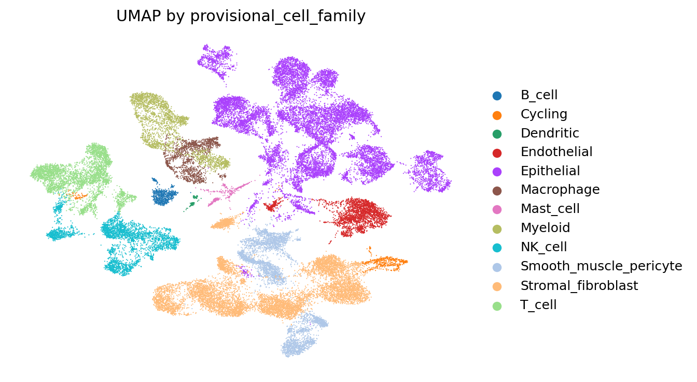
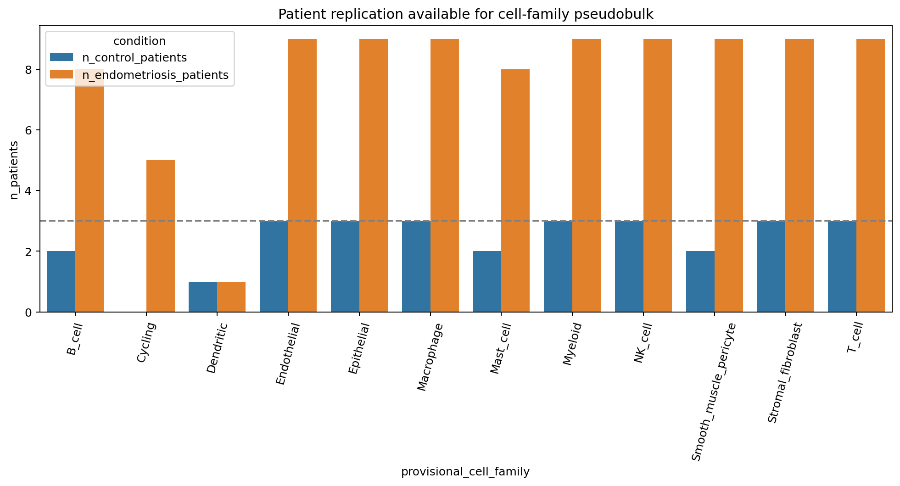
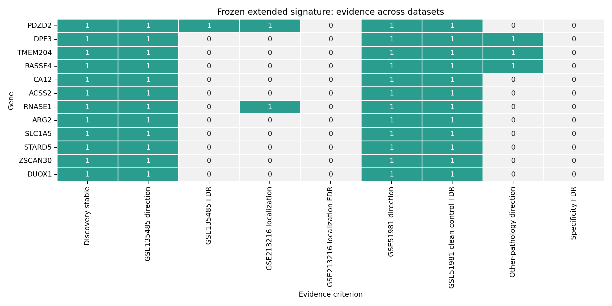
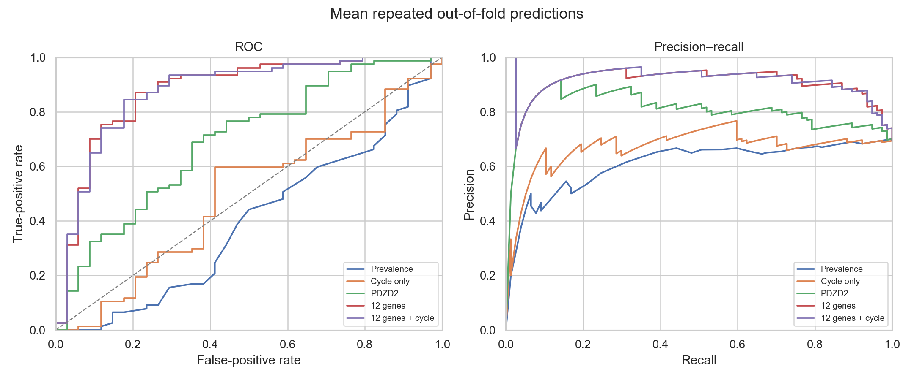
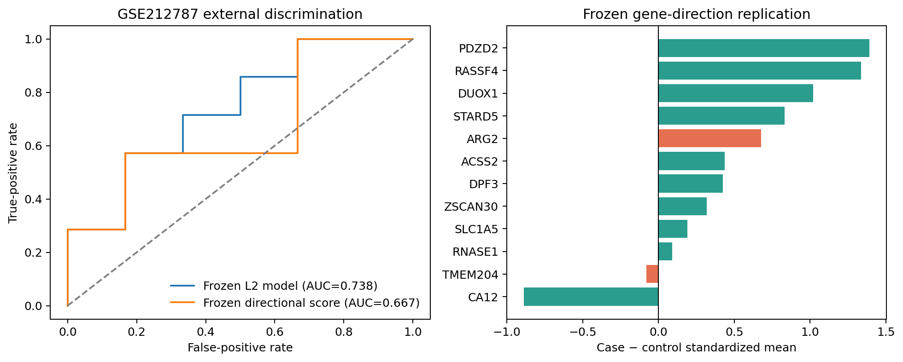
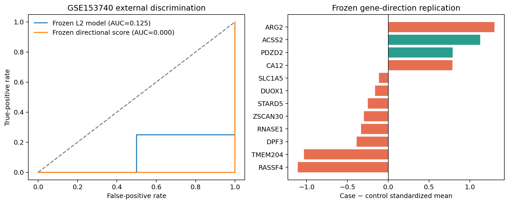
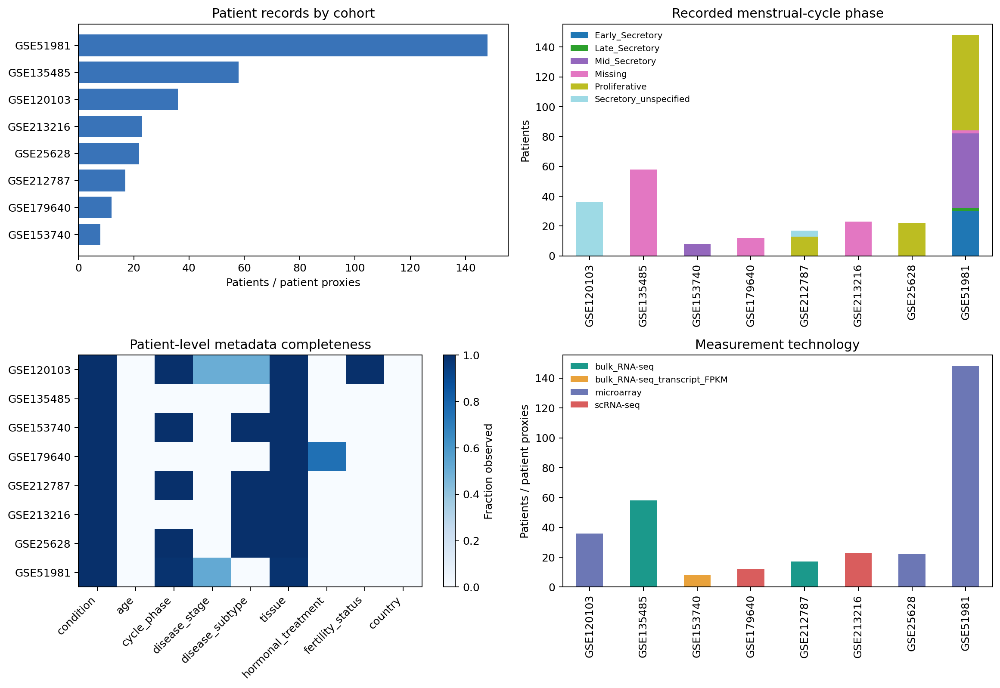
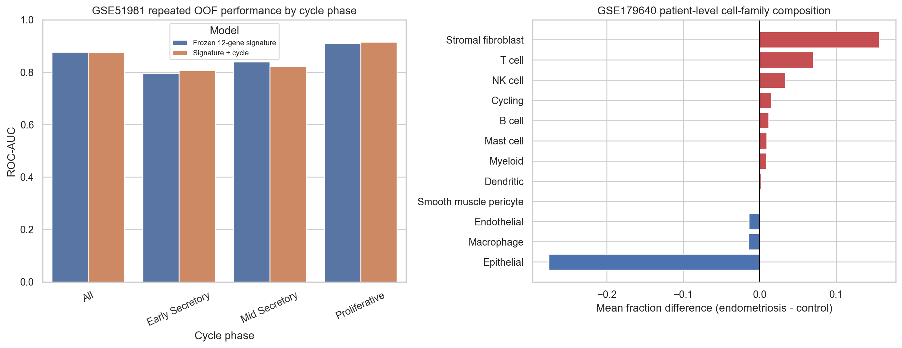

# EndoSignature-Net — Final Research Report

## Executive summary

EndoSignature-Net is a reproducible multi-cohort transcriptomics project that
asks whether cell-resolved endometriosis signals can be converted into a stable,
interpretable tissue-level molecular signature. The project combines public
single-cell, bulk RNA-seq, and microarray data; performs patient-level rather
than cell-level inference; and evaluates a frozen 12-gene classifier in
independent cohorts.

The key result is nuanced. The 12-gene signature has strong internal
discrimination between endometriosis and clean controls in GSE51981 (mean
repeated out-of-fold ROC-AUC 0.860) and promising transfer to GSE212787
(ROC-AUC 0.738), but it fails in the small, entirely mid-secretory GSE153740
cohort (ROC-AUC 0.125). Model coefficients are internally stable, so the
external inconsistency is more consistent with biological and technical
heterogeneity than unstable optimization. Only `PDZD2` and `ACSS2` preserve
their frozen direction in both external cohorts.

This project does **not** claim a clinical diagnostic test or causal biomarkers.
Its contribution is a leakage-aware workflow, a transparent cross-cohort stress
test, and a set of reproducible hypotheses about which signals transfer and
which do not.

## Research question

Can a compact gene signature discovered with patient-level single-cell
pseudobulk evidence:

1. reproduce across bulk transcriptomic technologies;
2. distinguish endometriosis from disease-free endometrium;
3. remain specific against other gynecologic pathology;
4. transfer to independent patients without external retuning; and
5. be interpreted at gene and patient level?

## Data and study design

The workflow used the following main GEO resources:

| Dataset | Technology | Role |
|---|---|---|
| GSE179640 | scRNA-seq | primary cell-resolved discovery |
| GSE213216 | scRNA-seq | independent cell-family localization audit |
| GSE135485 | bulk RNA-seq | secondary tissue-level directional replication |
| GSE51981 | Affymetrix microarray | evidence integration and patient-level modeling |
| GSE212787 | bulk RNA-seq | locked external replication |
| GSE153740 | transcript FPKM | locked mid-secretory replication |
| GSE120103 / GSE25628 | microarray | external eligibility and technical audits |

External candidates were not automatically modeled. GSE120103 remained on hold
after raw-data QC, and GSE25628 was not used because two frozen genes were
unavailable. These no-go decisions prevent outcome-guided repair.

## Cell-resolved discovery

Single-cell matrices were processed sparsely and sample by sample. Metadata,
tissue roles, QC decisions, doublets, and exclusions were recorded explicitly.
The primary comparison was restricted to eutopic endometrium and control
endometrium rather than pooling anatomically different lesions and organoids.

Differential expression was performed on patient-level pseudobulk profiles
within cell families. This avoids treating thousands of cells from the same
patient as thousands of independent biological replicates.

Candidate evidence was then integrated across discovery, bulk RNA-seq,
microarray, and cellular localization results. The final clean-control panel
contains:

`PDZD2`, `DPF3`, `TMEM204`, `RASSF4`, `CA12`, `ACSS2`, `RNASE1`, `ARG2`,
`SLC1A5`, `STARD5`, `ZSCAN30`, and `DUOX1`.

## Modeling results

Architectures were compared under repeated patient-level validation, including
logistic regression, elastic net, linear and nonlinear SVMs, tree ensembles,
and neural networks. The linear SVM achieved the highest mean internal ROC-AUC,
but differences among the strongest linear models were modest. L2 logistic
regression was frozen for external use because it provided direct gene-level
interpretability, stable regularized coefficients, and a transferable
probability output.

For 77 endometriosis and 34 clean-control patients in GSE51981, the frozen
12-gene baseline achieved:

- mean ROC-AUC: **0.860**;
- mean PR-AUC: **0.913**;
- mean balanced accuracy: **0.805**;
- mean sensitivity: **0.755**;
- mean specificity: **0.856**.

Adding menstrual-cycle covariates did not improve mean ROC-AUC. This does not
show that cycle phase is irrelevant; it shows only that the available encoded
cycle variable added little inside this cohort.

The specificity stress test was substantially weaker. Against 37 patients with
other uterine or pelvic pathology, the 12-gene panel achieved mean ROC-AUC
**0.560**. The signature therefore distinguishes endometriosis from clean
controls much better than it distinguishes endometriosis from clinically
relevant alternative pathology.

## Locked external replication

### GSE212787

All 12 genes passed mapping and label-blind QC in 13 independent target patients
(seven cases, six controls). The frozen model achieved ROC-AUC **0.738** with a
2,000-bootstrap 95% interval of **0.429-0.976**. Ten of 12 genes reproduced the
frozen direction. Leave-one-patient AUCs ranged from 0.686 to 0.829.

This is promising, patient-stable evidence, but the interval includes chance
and the cohort is too small for confirmation.

### GSE153740

All 12 genes and all eight patients passed label-blind intake. The cohort is
entirely mid-secretory and contains four cases and four controls. The locked
model achieved ROC-AUC **0.125** with a 95% interval of **0.000-0.500**. Only
two genes reproduced the frozen direction. Rechecking group labels, expression
aliases, sample order, and Ensembl transcript mapping found no reversal or
mapping error.

The predictions were not flipped after outcomes were observed. A post-hoc
reversal would be model selection on the test set, not validation.

## Interpretability and heterogeneity

One thousand class-stratified patient bootstraps showed that 11 of 12
coefficient signs were stable in at least 95% of resamples. `ARG2` was least
stable at 90.9%. Repeated held-out permutation importance ranked `SLC1A5`
highest, followed by `CA12`, `RNASE1`, `PDZD2`, and `ACSS2`.

Only `PDZD2` and `ACSS2` preserved the frozen disease direction in both
external cohorts. `ARG2` and `TMEM204` failed in both. Several influential
signals, including `SLC1A5`, `CA12`, and `RNASE1`, reversed in GSE153740.

The most defensible interpretation is that the model learns a reproducible
clean-control signal within some cohorts, but that tissue composition, cycle
phase, disease phenotype, and platform alter the observed gene relationships.

## Clinical metadata and sensitivity closure

A final harmonized metadata audit covered eight studies, 355 sample records,
and 324 deposited patients or explicitly marked patient proxies. It preserved
missingness rather than inferring unreported clinical variables. No verified
patient-level age or participant-country data were available across the
assembled sources. Disease stage was available only in selected GSE51981 and
GSE120103 records, while cycle phase was sufficiently complete in five studies
for descriptive—but not causal—sensitivity analysis.

The frozen GSE51981 predictions were then evaluated separately within recorded
cycle phases. When repeated out-of-fold predictions were averaged per patient,
the frozen signature had ROC-AUC 0.877 overall, 0.796 in early-secretory, 0.839
in mid-secretory, and 0.910 in proliferative samples. The 0.877 value is a
pooled ROC-AUC on averaged patient predictions and is distinct from the primary
mean-across-repeats estimate of 0.860 reported above. Adding cycle phase changed
the pooled value from 0.877 to 0.875, providing no evidence of incremental
predictive benefit inside GSE51981.

Patient-level cell-family composition was tested in the GSE179640 discovery
atlas using all 220 possible assignments of nine case labels among 12 patients.
The global centered-log-ratio PERMANOVA yielded R-squared 0.094 and p=0.414; no
individual provisional cell family survived FDR correction. The largest raw
shift was a lower epithelial fraction in endometriosis (-0.276, unadjusted
p=0.077), but the atlas contains only three controls and cannot rule out
composition as a contributor to cross-cohort heterogeneity.

These closure analyses narrow two candidate explanations without identifying a
causal driver of the failed GSE153740 replication. They support retaining the
negative external result rather than repairing the signature post hoc.

## Cross-check with published literature

### What agrees with prior work

The original GSE51981 study reported that eutopic endometrial expression can
classify endometriosis, while also showing immune, hormone-signaling, and
growth-factor changes. It explicitly used cycle-aware classifiers and other
pathology controls ([Tamaresis et al., 2014](https://pubmed.ncbi.nlm.nih.gov/25243856/)).
Our strong clean-control performance and weaker other-pathology specificity are
consistent with the fact that uterine pathologies can share molecular changes.

Large single-cell atlases show marked tissue-site, patient, cellular, and
menstrual-cycle heterogeneity. GSE179640 reported patient-level variation in
immune and fibroblast abundance and major compositional differences between
eutopic endometrium and controls
([Tan et al., 2022](https://pmc.ncbi.nlm.nih.gov/articles/PMC9901845/)).
GSE213216 showed that epithelial and stromal programs differ by tissue site and
hormonal context
([Fonseca et al., 2023](https://www.nature.com/articles/s41588-022-01254-1)).
The Human Endometrial Cell Atlas further emphasizes donor and cycle diversity
and identifies macrophage and decidualized stromal contexts as relevant to
endometriosis genetics
([Marečková et al., 2024](https://pmc.ncbi.nlm.nih.gov/articles/PMC11387200/)).
These observations make our cohort-dependent transfer result biologically
plausible.

Published biomarker guidance warns that menstrual progression can dominate
endometrial expression and that reported genes overlap poorly because of small
samples, confounding, and heterogeneous designs
([Devesa-Peiro et al., 2021](https://pmc.ncbi.nlm.nih.gov/articles/PMC8063681/)).
An earlier late-secretory study concluded that this transcriptome did not
support a minimally invasive test
([Sherwin et al., 2008](https://doi.org/10.1093/humrep/den078)).
The negative all-mid-secretory GSE153740 result is therefore credible rather
than biologically absurd, although eight samples cannot isolate cycle phase as
the cause.

At gene level:

- `SLC1A5`, the strongest internal permutation feature, has experimental links
  to glutamine metabolism, ROS, and ferroptosis in endometriosis models
  ([Ma et al., 2025](https://pubmed.ncbi.nlm.nih.gov/40464516/)). This supports
  mechanistic plausibility, not diagnostic validation.
- `RNASE1` has appeared in integrated transcriptomic analyses, often in
  ectopic-versus-eutopic comparisons
  ([Vallvé-Juanico et al., 2019](https://eprints.soton.ac.uk/440729/)).
  That contrast differs from disease-eutopic versus healthy control.
- `ACSS2` has direct human and functional evidence, but a 2024 study reported
  **lower** expression in endometriosis endometrium and increased proliferation
  and migration after knockdown
  ([Ji et al., 2024](https://pmc.ncbi.nlm.nih.gov/articles/PMC11193987/)).
  This conflicts with our frozen positive direction and cautions against calling
  it a settled biomarker.
- `PDZD2` was reported from the original GSE51981 lineage. Its rediscovery is
  useful pipeline corroboration but is not independent novelty.

### What this project adds

No individual gene can be claimed as a newly discovered clinical biomarker.
The strongest original result is instead **the combined evidence structure**:

1. a patient-level, cell-informed 12-gene signature was carried across
   technologies under locked rules;
2. internal coefficient stability did not guarantee external biological
   direction stability;
3. two small external cohorts produced sharply different results despite full
   panel coverage;
4. `PDZD2` and `ACSS2` emerged as a two-gene cross-cohort directional core, but
   the literature is conflicting for `ACSS2`; and
5. failure localized to cohort-dependent gene-direction changes rather than one
   influential patient or one unstable fitted coefficient.

Items 2-5 are research findings from this analysis and useful hypotheses for a
future preregistered study. They are not proof of novelty in the patent,
diagnostic, or causal-biological sense.

## Limitations

- Public cohorts are small and clinically heterogeneous.
- Verified age and participant-country metadata are unavailable for formal
  adjustment in the assembled cohorts.
- Clean controls are easier to distinguish than symptomatic pathology controls.
- Some datasets use lesion tissue and others use eutopic endometrium.
- Menstrual phase and hormonal treatment are incompletely balanced.
- Cross-platform cohort standardization is label-blind but transductive and is
  not a deployable single-sample normalization procedure.
- GSE179640 discovery and GSE51981 modeling both contributed to feature
  definition, so internal performance is not external validation.
- Cellular localization does not establish that a cell family causes the
  tissue-level disease effect.
- The composition sensitivity analysis has only three controls, uses
  provisional cell-family annotations, and is not independent of discovery.
- Gene expression association and model importance do not establish causality.

## Final conclusion

EndoSignature-Net demonstrates a rigorous end-to-end computational research
workflow: metadata auditing, sparse single-cell QC, patient-level pseudobulk
discovery, multi-study evidence integration, architecture benchmarking,
patient-level validation, locked external testing, negative-result reporting,
interpretable failure analysis, and predeclared sensitivity closure.

The project supports a research signature with partial external transfer, not a
clinical diagnostic. Its most important lesson is that internally stable
molecular models can still fail when disease phenotype, cycle phase, tissue
composition, and assay technology change. That conclusion is scientifically
consistent with the endometriosis literature and is the reason the project is
complete rather than continuously retuned.

**Project status: complete as a portfolio-scale computational research study.**
Further biomarker development should begin as a new preregistered study with a
larger independent cohort, clinically harmonized covariates, disease controls,
and a deployable single-sample normalization protocol.
